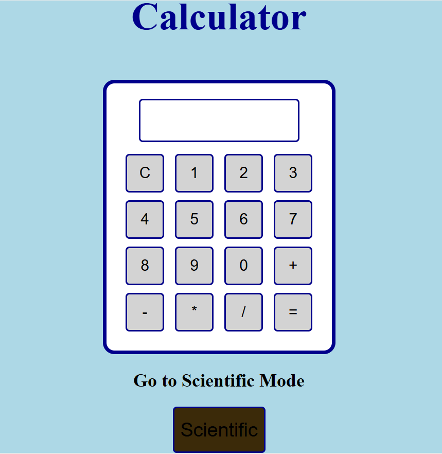

# **Tic Tac Toe Game & Calculator**

### **Project Description**
A simple and interactive game built using **HTML**, **CSS**, and **JavaScript**. This project demonstrates basic games, including the creation of an interactive UI component, handling user input, and implementing game logic. The project includes games like Tic Tac Toe and a Calculator.

---

### **Table of Contents**
- [Installation](#installation)
- [Usage](#usage)
- [Features](#features)
- [Screenshots](#screenshots)
- [Contributing](#contributing)
- [License](#license)

---

### **Installation** <a name="installation"></a>
To get this project up and running locally on your machine, follow the steps below:

1. **Clone the repository** to your local machine using Git:
   ```bash
   https://github.com/AggeSak/2DGames.git

2.### **Usage** <a name="usage"></a>
To use this project navigade with cd command to the game of your choice and run the html file of your choice

3. ### **Features** <a name="features"></a>

4. ### **Images of the Games** <a name="screenshots"></a>



